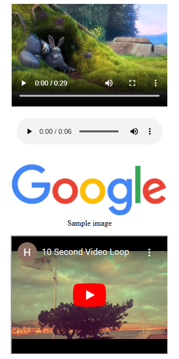

# **Meta: HTML and CSS in Depth - Solutions**  

This repository contains my solutions to exercises and projects from the [Meta HTML and CSS in Depth](https://www.coursera.org/learn/meta-html-and-css-in-depth) course. This course dives into advanced HTML and CSS concepts, enabling developers to create robust, scalable, and visually engaging web pages.  

## **About the Repository**  
This repository showcases my work as I applied the principles and techniques taught in the course. Each folder corresponds to specific modules or assignments, demonstrating the following:  
- Use of semantic HTML for structured content  
- Advanced CSS for responsive and modern designs  
- Best practices for accessibility and maintainability  

## **Contents**  
| Folder/Project        | Description                                        | Concepts Highlighted         |
|------------------------|----------------------------------------------------|------------------------------|
| `html-forms`          | Form design with proper validation and semantics  | HTML Forms, Accessibility    |
| `responsive-design`   | Responsive layouts for multiple devices           | Media Queries, Flexbox, Grid |
| `css-animation`       | Interactive animations and transitions            | Keyframes, CSS Transitions   |

## **Screenshots**
  
*This is an example of a solution to a task in the course*

## **Learning Objectives**  
Through this course and repository, I gained expertise in:  
- Structuring web content with semantic HTML  
- Styling web pages using advanced CSS techniques  
- Building responsive and adaptive web layouts  
- Ensuring web accessibility for a wide range of users  
- Writing maintainable and reusable CSS

## **Acknowledgements**  
A big thank you to the [Meta Front-End Developer Professional Certificate](https://www.coursera.org/professional-certificates/meta-front-end-developer) team for crafting this in-depth course.  
Inspired by Meta’s vision of empowering developers with essential skills for modern web development.  

## **License**  
This repository is for educational purposes only. Please do not use these solutions as your own in any submissions or projects.
